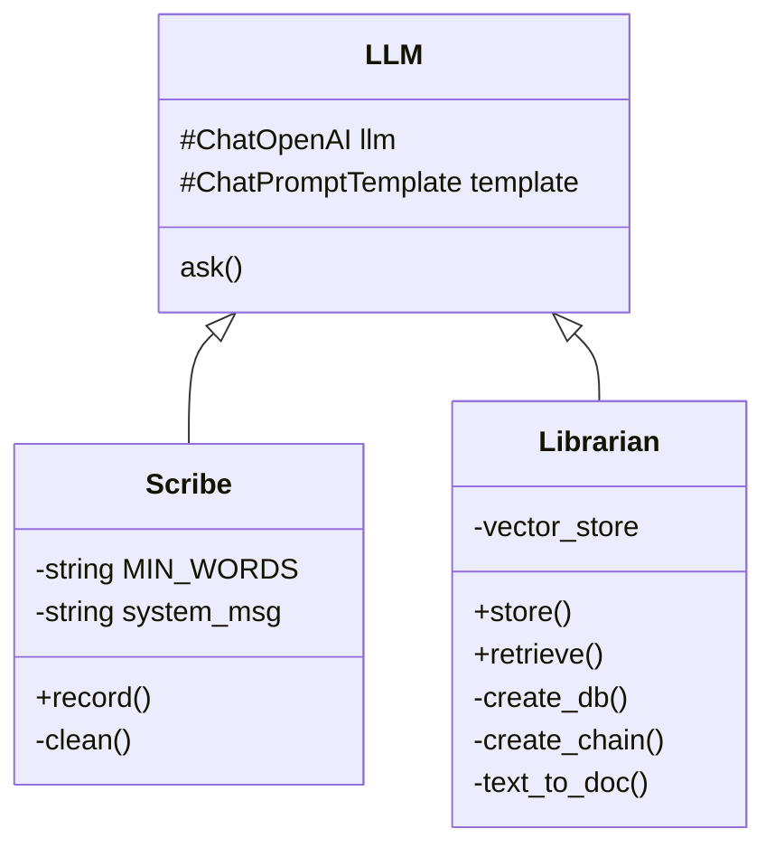

# Jotdown
### Your CLI note-taking companion

> [!Important]
> This README is not finished and the app is not ready for use. Check the to-do list [below](#to-dos-v1) for current features.

Jotdown is a note-taking app for devs. Take daily notes during the week and review them on sunday.

## Features
- take notes in your terminal
- ask questions about your notes with LLM+RAG

## Try it

1. install: `pip install jotdown-tool`
2. write `jotdown` in your terminal

```bash
$ jotdown
```

## How it works
There are two main features:
1. Taking notes
2. Asking questions about the notes



#### Taking notes

- ncruses
- saving the notes + metadata (vector database)

#### Asking questions about the notes

- retieving relevant notes from vector database
- chat history
- send both retrieved chunks and history in context window


## To-do's (v1)
Fixes
- [ ] vdb: add notes instead of replacing

Features
- [x] take user input and output in streams (chunks of text)
- [x] add minimum word requirements
- [x] convert note to document, with metadata like daytime, content tags,..
- [x] store document in vector store (FAISS or Pinecone)
- [x] retrieve relevant notes to answer a question (similarity search, hybrid search)
- [ ] add chat history
- [x] word countdown while typing (curses)

Enhancements
- [ ] use function calling
- [ ] use local db instead of in-memory db
- [ ] add automated testing (pytest, mypy, github actions)
- [ ] add class attributes to monitor token usage and api calls to openai

User Experience
- [x] use curses for better UX
