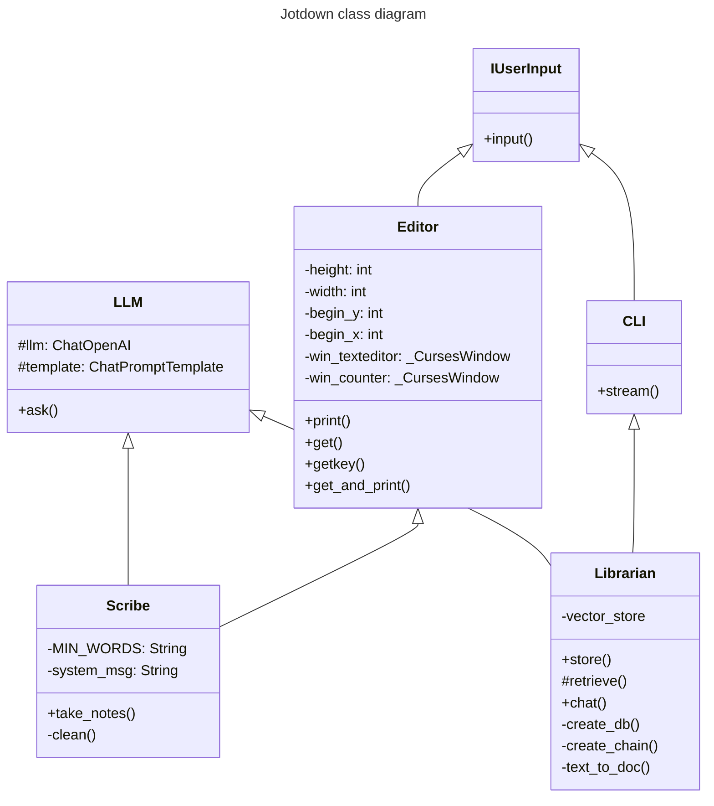

# Jotdown
### Your CLI note-taking companion
Jotdown is a note-taking app for devs. Everything is done in the terminal, during the week you can only take notes, and on sundays you can ask questions about your notes for review.

## Try it

1. Clone the project
2. Create and activate an environment: a) ``python -m venv jotdown-venv`` then b) ``source jotdown/bin/activate``
2. Install the dependencies by running ``make install``
3. run ``make``
- if it's a weekday (MON-SAT), you'll be able to write notes. On sunday, you'll be able to review your notes by asking questions.

## How it works
Jotdown is basically 2 features, taking notes and asking questions about the notes. Here is how both are implemented:

1. __Taking notes__
    
    I used the [ncurses](https://docs.python.org/3/howto/curses.html) library to provide a better user experience. It allowed me to do the following which is not possible with the standard input function.
   - multi-line writing and editing like in normal text editors
   - show word count, to know when you hit your daily words goal
   - show custom messages while writing
   - custom actions based on key-press (press ESC to exit)

    Once you finish taking notes, it is saved in a vector database so that when I want to review my week, I can retrieve relevent notes to answer my questions.

2. __Asking questions about the notes__

    After retrieving notes that are relevant to my question, I add them as context to the API call to OpenAI.
    I used Langchain as framework to interact with OpenAI and format my prompt templates.

### System Design

## Improvements
- [ ] db: use local db instead of in-memory db
- [ ] ui: use ncurses editor => text editing
- [ ] test: add automated testing (pytest, mypy, github actions)
